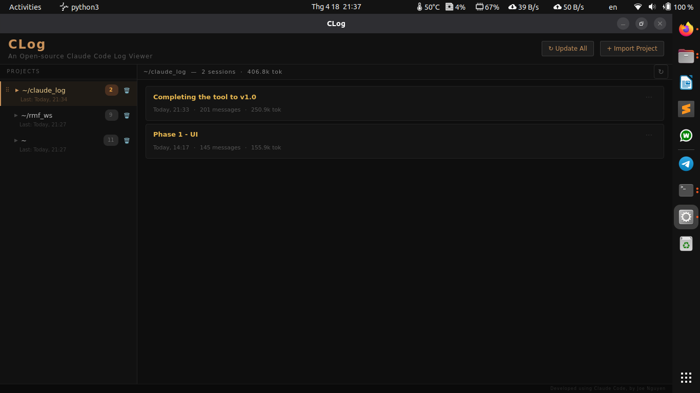

# CLog

**An open-source GUI log viewer for [Claude Code](https://claude.ai/code) sessions.**

Ever wanted to see past information like you can on claude.ai chats, or most other common chat services out there? Sureee, ```claude --resume``` works fine, if you're a masochist! Well I'm not, so CLog was born.

CLog is a Claude Code log viewer (view only, no edits, no further chatting). Browse, search, and explore your Claude Code conversation history — message by message, with token counts, tool call details, effort levels, and more. 100% local operations.



---

## Features

- **Browse all projects and sessions** from your Claude Code history.
- **Per-message detail** — model, effort level, token count, thinking badges
- **Basic stats** — token count, per message, per session & per project. Message count per session; session count per project.
- **Organize your log** — rename, pin/unpin sessions. **Drag-to-reorder** projects in the sidebar, click the **🗑** icon on a project card. Note: this removes the project from CLog's view only — no files are deleted from disk.
- **Update / refresh** — re-read JSONL files and report what changed.
- All operations only affect the GUI viewer. CLog reads your Claude Code session logs **locally only**. No data is sent anywhere. No change is made to any file on disk, only to what CLog shows. Config is stored in `~/.config/claude_log/`.
---

## Requirements

- Python 3.10+
- PyQt6

```bash
pip install PyQt6
```

---

## Installation

```bash
git clone https://github.com/jn799/clog.git
cd clog
pip install -r requirements.txt
python3 main.py
```

On first launch, click **+ Import Project** and point it at a Claude Code project directory (typically `~/.claude/projects/<project-name>/`).

---

## Contributing

Pull requests are welcome. Feedbacks are welcome. Comments, questions, concerns, encouragement, insults, etc. anything is welcome!

---

## License

MIT — see [LICENSE](LICENSE).
